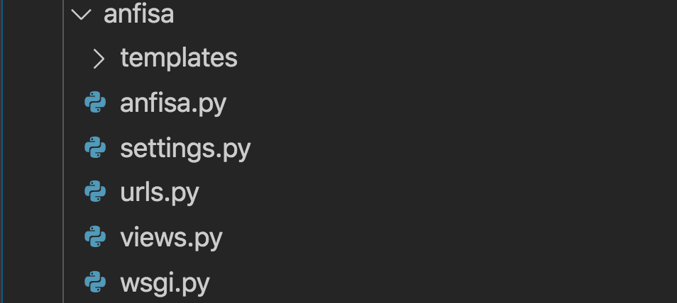
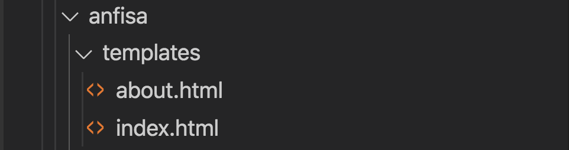
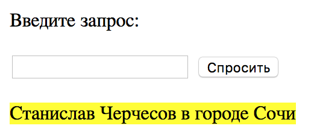
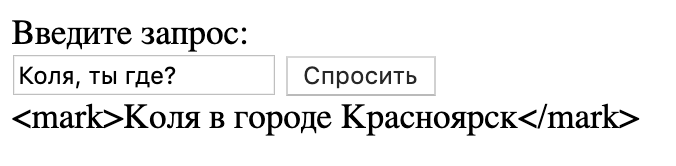
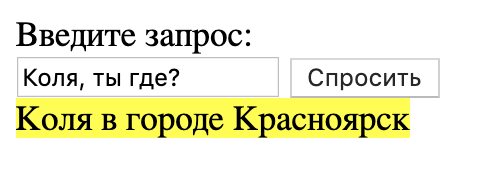

# 1. Вспомнить всё

Самое время создать полноценное веб-приложение с пользовательским интерфейсом: ваших знаний для этого уже достаточно.

За два урока вы сделаете из робота-референта Анфисы отличный веб-сервис, и Django упростит вам эту работу.

## Что в коде?

Мы собрали в отдельный файл весь код Анфисы из уроков по Python. Ещё мы добавили комментариев, чтобы вам легче было читать. Вмешиваться в этот код мы не станем, а просто подключим его к проекту как библиотеку.

Кратко напомним, что там к чему:

    # обработка вопросов к Анфисе
    def process_anfisa(query):
        if query == 'сколько у меня друзей?':
            count_string = format_count_friends(len(DATABASE))
            return f'У тебя {count_string}'
        elif query == 'кто все мои друзья?':
            friends_string = ', '.join(DATABASE.keys())
            return f'Твои друзья: {friends_string}'
        elif query == 'где все мои друзья?':
            unique_cities = set(DATABASE.values())
            cities_string = ', '.join(unique_cities)
            return f'Твои друзья в городах: {cities_string}'
        else:
            return '<неизвестный запрос>'

    # обработка вопросов к друзьям
    def process_friend(name, query):
        if name in DATABASE:
            city = DATABASE[name]
            if query == 'ты где?':
                return f'{name} в городе {city}'
            elif query == 'который час?':
                if city not in UTC_OFFSET:
                    return f'<не могу определить время в городе {city}>'
                time = what_time(city)
                return f'Там сейчас {time}'
            elif query == 'как погода?':
                weather = what_weather(city)
                return weather
            else:
                return '<неизвестный запрос>'
        else:
            return f'У тебя нет друга по имени {name}'

    # Обработка всех запросов.
    # Определение типа запроса - либо к друзьям, либо к Анфисе.
    def process_query(query):
        tokens = query.split(', ')
        if len(tokens) < 2:
            return '<неверный запрос>'
        name = tokens[0]
        if name == 'Анфиса':
            return process_anfisa(tokens[1])
        else:
            return process_friend(name, tokens[1])

Анфиса понимает запросы двух типов: вопросы к друзьям пользователя и вопросы к ней самой. За их обработку отвечают функции process_friend() и process_anfisa().

Каждая функция распознаёт, о чём спрашивает пользователь, и вызывает вспомогательную функцию. Например, what_weather() для получения данных о погоде:

    # получение данных о погоде
    def what_weather(city):
        url = f'http://wttr.in/{city}'
        weather_parameters = {
            'format': 2,
            'M': ''
        }
        try:
            response = requests.get(url, params=weather_parameters)
        except requests.ConnectionError:
            return '<сетевая ошибка>'
        if response.status_code == 200:
            return response.text.strip()
        else:
            return '<ошибка на сервере погоды>'

## Что в проекте?

Новый проект будет состоять всего из одного приложения — anfisa. Это приложение будет «приложением по умолчанию», в нём будет находиться и единственный на всё приложение файл urls.py.

Логика Анфисы будет представлена в файлах anfisa.py и views.py

В папке templates будут храниться шаблоны страниц интерфейса:

* шаблон главной страницы с формой для отправки вопросов index.html
* шаблон about.html с описанием Анфисы

# 2. Релиз: Анфиса 2.0

Фронтенд-разработчики подготовили шаблон страницы с веб-формой: из неё пользователи будут отправлять запросы к Анфисе. Сейчас вы напишете обработку запросов.

Сначала внимательно посмотрите на шаблон index.html. Там много нового.

    <form action={{ where }} method="post">

Эта строка создаёт веб-форму с опредёленными атрибутами.

Атрибут method со значением post интуитивно понятен: он требует от браузера отправлять данные из этой формы методом POST.

Атрибут action сообщает браузеру, на какой адрес следует отправить данные из формы. Здесь в action подставляется значение переменной where — в ней передаётся головной адрес вашего сервера.

Поле для ввода текста имеет атрибут name со значением query:

    <input type="text" name="query">

Это вам уже знакомо: на сервер уйдёт POST-запрос, а в нём будет

    {
        query: "то, что пользователь ввёл в поле ввода"
    }

Ещё в шаблоне страницы вам встретится следующая конструкция:

    {{ response | safe }}

Вы уже знаете, что в шаблоне Django в двойных фигурных скобках выводятся значения элементов из словаря context. Таким образом, запись {{ response | safe }} вам частично знакома: из словаря context выводится значение по ключу response.

Но что такое safe? Внутри фигурных скобок вертикальная черта | отделяет ключ словаря context от опций, определяющих формат вывода значения, которое соответствует ключу.

Если не указывать опцию safe, то выводимое значение будет интерпретировано как текст, а не как HTML-код.

Если просто {{ response }}

Если {{ response | safe }}:

Теперь в шаблоне не осталось тёмных мест и белых пятен. Время кодить.

## Алгоритм

на главную страницу приходит POST-запрос
- URL Mapping распознаёт запрошенный URL Path в urls.py и, если он пуст (то есть равен ''), вызывает функцию index()
- в index() происходит разбор POST-запроса и вызов функции из модуля anfisa
- отработка выбранной функции в anfisa.py
- получение из anfisa.py результата и оформление его в HTML-код
- наполнение словаря context
- вызов render() и отправка страницы пользователю (той же самой главной страницы, но с добавлением ответа Анфисы).

Ваша работа делится на три этапа:

1. Дать доступ к главной странице Анфисы по веб-адресу {URL}.
2. Подключить к файлу views.py библиотеку anfisa.py; из библиотеки anfisa.py вызвать нужную функцию для обработки вопроса.
3. Скомпоновать страницу ответа и отправить её пользователю.
Перейти к заданию