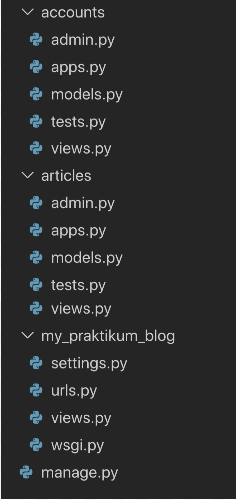
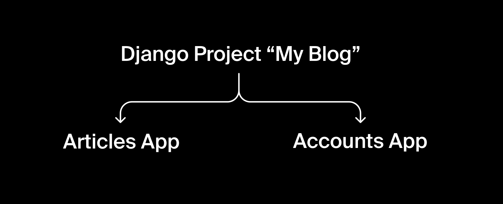
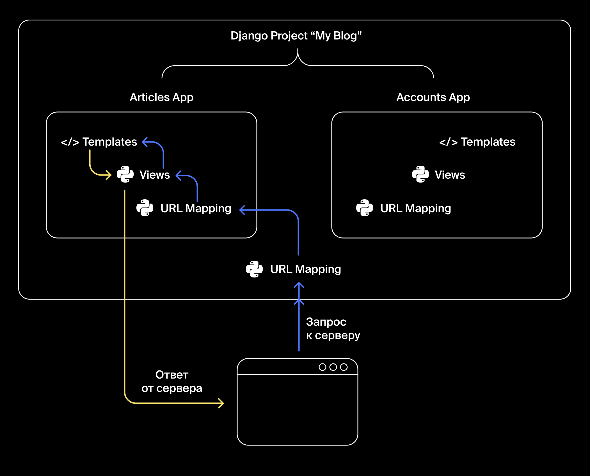

# Django

# 3. URL Mapping: создаём ответ

Django Views    -   отвечает за созданием ответа на запрос пользователя

Одна отдельная функция называется view-функция.

В качестве аргумента view-функция принимает HTTP-запрос (объект HttpRequest, его создаёт Django), а возвращает HTTP-ответ (объект HttpResponse), который формируется по указанному разработчиком алгоритму.

HttpResponse содержит:

- контент ответа: простой текст, код HTML, данные в JSON, файл, изображение — практически любые данные, по выбору разработчика
- техническую информацию, сопровождающую ответ: например, код ответа сервера, кодировку ответа, тип контента (скажем, передаётся текстовая строка или файл в Excel).

View-функции принято хранить в файле views.py. Такой файл создаётся для каждого приложения. В вашем блоге будет три файла views.py: один для приложения Articles App, другой — для Accounts App. Ещё один обрабатывает запросы к главной странице проекта.

Для приложений в проекте создаются отдельные директории /articles и /accounts. На одном уровне с ними — директория my_praktikum_blog. Это головная директория проекта «по умолчанию»: именно в ней находится корневой файл urls.py сервера, здесь же лежат views для главной страницы и файлы настройки проекта.

## Как устроена обработка запросов

Чтобы функция path() могла вызвать view-функции из файлов views.py, импортируем эти файлы.

Так, в urls.py нашего блога будут импортированы три файла views.py: из головной директории и из папок приложений:

    # код файла urls.py в директории /my_praktikum_blog

    from django.urls import path 
    # переназовём файлы views.py, чтобы избежать конфликта имён.
    # импортируем views.py из папки приложения Articles App:
    from articles import views as art_views # ...и будем звать его art_views

    # импортируем views.py из папки приложения Accounts App:
    from accounts import views as acc_views # ...и будем звать его acc_views 

    # импортируем views.py из директории по умолчанию:
    from . import views # ...а давать ей специальное имя не будем, оставим views

    urlpatterns = [ 
        path('', views.index), 
        path('dashboard', art_views.dashboard), 
        path('sign_up', acc_views.sign_up), 
        path('sign_in', acc_views.sign_in), 
        path('my_account', acc_views.my_account), 
    ]

Теперь мы готовы ответить на запрос пользователя. Знакомиться с блогом он начнёт с главной страницы и запросит адрес http://my-blog.praktikum.yandex.ru/. В urls.py сработает шаблон "" и будет вызвана функция index()

    # код файла views.py из директории /my_praktikum_blog

    # из библиотеки django.http импортируем тип HttpResponse:
    from django.http import HttpResponse

    # здесь объявлена функция index, которая отдаёт главную страницу
    def index(request):
        # создаём объект типа HttpResponse
        resp = HttpResponse('<h1>Главная страница проекта My Praktikum Blog</h1>')
        # и возвращаем его
        return resp

В результате работы urls.py и view-функции index() пользователь увидел в браузере текст, написанный Очень Крупными Буквами: Главная страница проекта My Praktikum Blog

## Тест

    urlpatterns = [ 
        path('', views.index), 
        path('anybody-seen-my-baby', views.i_see), 
        path('how-much-is-the-fish', views.see_price_tag), 
        path('smoke-on-the-water', views.fire_in_the_sky), 
        path('we-are-the-champions', views.my_friend),
        path('who-you-re-gonna-call', views.ghostbusters
        ), 
        path('what-is-love', views.love_is_strong)
    ]

### Какой веб-адрес надо запросить, чтобы сработала view-функция see_price_tag()

* /anybody-seen-my-baby
* /i-see
* /how-much-is-the-fish
* /oops-i-did-it-again
* /who-you-re-gonna-call
* /let-it-be
* /we-are-the-champions
* /what-is-love

        urlpatterns = [ 
            path('', views.index), 
            path('sanguine', views.be_useful), 
            path('choleric', views.rule), 
            path('melancholic', views.avoid), 
            path('phlegmatic', views.relax)
        ]
        def index(request):
            return HttpResponse('<h1>Четыре темперамента</h1>')
        def be_useful(request):
            return HttpResponse('<h1>Быть полезным</h1>')
        def rule(request):
            return HttpResponse('<h1>Командовать</h1>')
        def avoid(request):
            return HttpResponse('<h1>Избегать</h1>')
        def relax(request):
            return HttpResponse('<h1>Расслабиться</h1>')

Какой адрес на сайте http://four_temperaments.com надо вызвать, чтобы вернуть пользователю страницу с заголовком «Командовать»?

* http://four_temperaments.com/rule
* http://four_temperaments.com/choleric
* http://four_temperaments.com/melancholic
* http://four_temperaments.com/zombie
* http://four_temperaments.com/sanguine
* http://four_temperaments.com/phlegmatic

# 5. Параметры в путях

Однажды наш блог станет популярен, в нём будут сотни аккаунтов и тысячи статей. Разумеется, перечислить все адреса страниц в urls.py будет невозможно.

В URL Mapping предусмотрено решение этой задачи: для обработки однотипных адресов Django применяет шаблоны с переменными.

Добавим в конец списка ещё один шаблон:

    from django.urls import path
    from accounts import views as acc_views
    from articles import views as art_views 
    from . import views

    urlpatterns = [
        # пишем шаблоны для сопоставления URL и функций
        path('', views.index),
        path('accounts/sign-up', acc_views.sign_up),
        path('accounts/sign-in', acc_views.sign_in),
        path('accounts/my-account', acc_views.my_account),
        path('articles/dashboard', art_views.dashboard),   
        path('articles/<int:id>', art_views.article_by_id), # смотри, смотри: шаблон с переменной!
    ]

В записи articles/<int:id> конструкция <int:id> означает, что id — это переменная типа int, она может принимать любые целочисленные значения. В таких случаях говорят «ожидается тип данных int».

В результате, при обращении и к адресу http://my-blog.praktikum.yandex.ru/articles/123, и к адресу http://my-blog.praktikum.yandex.ru/articles/73374954 будет вызвана одна и та же функция article_by_id() из файла articles/views.py.

Аналогичным образом можно обрабатывать и переменные, содержащие строку, например: <str:username> или <str:tag>.

Например, ссылка на страницу аккаунта Mark Zuckerberg могла бы выглядеть так: http://my-blog.praktikum.yandex.ru/accounts/profile/mark-zuckerberg.

А вот так в файле urls.py выглядел бы шаблон для обработки запросов к этой странице:

    path('accounts/profile/<str:username>', acc_views.username)

# 6. GET и POST запросы

тобы заставить сервер что-то делать, нужно отправить ему запрос. Например, обратиться к нему по определённому адресу.

Два самых распространённых типа запросов — это GET и POST.

GET-запросы применяют, когда в ответ нужно просто получить какую-нибудь страницу или информацию от сервера.

POST-запросами отправляют информацию на сервер — для сохранения или изменения данных.

Вы ежедневно отправляете сотни запросов из браузера на всевозможные сайты:

* Всякий раз, когда вы открываете сайт, ваш браузер посылает GET-запрос на сервер — и тот возвращает браузеру запрашиваемую страницу.
* Самый простой пример создания POST-запроса — это отправка данных через поле ввода на сайте. Так, например, браузер делает POST-запрос, когда вы ищете что-то в Яндексе или заказываете товары в интернет-магазине.

GET- и POST-запросы могут содержать дополнительные данные для корректной работы view-функций и генерации правильного ответа.

Например, если вы безо всяких дополнительных данных запросите главную страницу Яндекса — она, конечно же, откроется. Но если с запросом будет передана дополнительная информация о вашем аккаунте — Яндекс вас «узнает» и предоставит доступ к вашей почте, к вашему Яндекс.Практикуму и к другим сервисам, требующим авторизации.

POST-запросом можно передавать любые данные. Например, при заказе товара в интернет-магазине имя и адрес доставки будут отправлены как текст, номер карты — как число, а схема «куда доставить товар» — как файл.

Типичный случай отправки POST-запроса — регистрация на веб-сервисе.

В HTML-коде страницы это выглядит так:

    <form method="post"><!-- здесь сказано, какой метод применять при отправке: POST-->
        

            <label class="label">Имя</label>
            <input type="text" name="login">
            <label class="label">Email</label>
            <input type="email" name="mail">
        

        <input type="submit" value="Регистрируюсь">
    </form>

После отправки этой формы на сервер уйдёт запрос — текст в определённом формате:

В первой строке запроса — название метода, здесь это POST. Далее указан путь, по которому отправлен запрос — /, это обращение к главной странице сайта. И завершает первую строчку версия протокола — HTTP/1.0.

Отправленные через форму данные приходят на сервер в виде пар "имя=значение". Таких пар бывает много, друг от друга они отделяются амперсандом &: login=Tony&mail=ironman@stark.com

Имя берётся из HTML-разметки формы:

    <input type="text" name="**login**"> <!-- имя задано в атрибуте name -->

Значение, соответствующее имени, пользователь вводит в форму сам.

GET-запрос всю информацию передаёт в URL.

У GET-запроса есть особенности:

* через GET можно передавать буквы и цифры, но не файлы
* не рекомендуется передавать приватную информацию (странно и небезопасно отправлять логин и пароль в открытом виде: http://her-majesty-secret-service.uk?login=JamesBond&password=007)
* браузеры могут кешировать посещённые страницы: вы вчера посетили определённую страницу, сегодня снова зашли на неё — но браузер покажет вам её вчерашнее состояние

Но у GET есть и плюсы: полученная через GET-запрос страница имеет определённый веб-адрес, его можно сохранить в закладки или переслать кому-то. Это, скажем, страница с результатами поиска или с отфильтрованными данными. Со страницей, полученной через POST-запрос, этот номер не пройдёт.

## Какой из этих запросов следует отправить именно методом POST

# 7. Объект HttpRequest

Получив GET- или POST-запрос, Django извлекает из него всю информацию и в структурированном виде помещает в объект HttpRequest. Переменную, которая хранит этот объект, обычно называют request.

Именно переменная request передаётся как обязательный аргумент во view-функцию:

    def index(request):
        # какой-то код

Объектом в языках программирования называют набор свойств и методов, каждый из которых имеет своё имя (ключ). Чтобы получить значение по имени (по ключу), имя свойства или метода записывают через точку после имени объекта.

Значением свойства может быть строка, функция (такое свойство называется метод), другой объект, коллекция, и вообще данные любого типа.

Название метода запроса — GET, POST или другой — записано в объекте HttpRequest и доступно по ключу method

Если нужно узнать тип полученного запроса — обращаемся к свойству method объекта request. Получить значение свойства можно вот таким выражением: request.method

    def check_method(request):
        return request.method 
    # функция check_method() вернёт название метода запроса: 
    # например — GET или POST

Информация, переданная с запросом, сохраняется в словаре request.GET или request.POST, в зависимости от типа запроса.

Можно сказать так: «у объекта request есть свойство POST, в нём хранится словарь с информацией из запроса».

    # В запросе на сервер переданы логин и email пользователя,
    # Django сложил информацию в словарь request.POST
    {
        'login' : 'Tony',
        'mail' : 'ironman@stark.com'
    }

    # view-функция узнаёт тип запроса 
    # и достаёт из свойства request.POST данные пользователя:
    def index(request):
        if request.method == 'POST':
            new_login = request.POST['login']  # new_login = 'Tony'
            new_mail = request.POST['mail']  # new_mail = 'ironman@stark.com'

Сходным образом выглядит и словарь request.GET.

Если пользователь Tony отправит нам информацию методом GET, то его данные будут переданы прямо в строке URL, и в адресной строке браузера запрос будет выглядеть так: http://my-blog.praktikum.yandex.ru?login=Tony&mail=ironman@stark.com

Дальнейший процесс обработки будет точно такой же, как в случае POST-запроса

    # теперь везде GET, но обработка точно такая же
    # В GET-запросе на сервер переданы логин и email пользователя,
    # Django сложил информацию в словарь request.GET
    {
        'login' : 'Tony',
        'mail' : 'ironman@stark.com'
    }

    # view-функция узнаёт тип запроса 
    # и достаёт из свойства request.GET данные пользователя:
    def index(request):
        if request.method == 'GET':
            new_login = request.GET['login']  # new_login = 'Tony'
            new_mail = request.GET['mail']  # new_mail = 'ironman@stark.com'

Обычно пользователи передают данные на сервер через «веб-формы» — специальные HTML-объекты, отправляющие информацию пользователя на сервер.

Поля для ввода текста, чекбоксы-галочки, календари для выбора даты, кнопки выбора, выпадающие списки — всё это элементы форм. Данные об их состоянии отправляются на сервер (обычно в виде POST-запроса) после нажатия на кнопку типа submit.

# 8. Templates: алгоритмы отдельно от оформления

Пока что во всех view-функциях было минимальное количество HTML-кода. Однако назвать «готовым продуктом» те страницы, что у нас получались, язык не поворачивается: даже самая простая веб-страница обычно содержит десятки строк кода.

Можно хранить HTML-код прямо внутри view-функций, но очень скоро такой код станет невозможно читать и поддерживать.

Всё выглядит компактно, пока на главной странице блога отображается лишь заголовок:

from django.http import HttpResponse

    def index(request):
        return HttpResponse('<h1>Добро пожаловать!</h1>')

Но как только вы добавите на страницу оглавление сайта и краткое описание каждого раздела, код разрастётся:

from django.http import HttpResponse
    
    def index(request):
        return HttpResponse('<h1>Добро пожаловать!</h1>
Вы можете попробовать' +
            ' ввести в адресную строку следующие пути:
<ul><pre><li>' +
            ' articles<ul><li>/dashboard - отображает статьи за текущий год</li>' +
            ' <li>/dashboard/int:year - отображает статьи за указанный год </li>' +
            ' <li>/int:id - отображает статью с указанным id</li><li>/str:user - ' +
            ' отображает статьи указанного пользователя</li><li>/tag/str:tag - отображает' +
            ' статьи с указанным тэгом</li></ul></li><li> accounts<ul><li>/friends/str:user' +
            ' - отображает друзей указанного пользователя</li></ul></li></pre></ul>')

Гораздо удобнее хранить HTML-код в отдельных файлах, подключая их по необходимости. Этим управляет механизм Templates.

Сами по себе шаблоны — это HTML-файлы, их принято размещать в папке templates/ в головной директории приложения.

В директории templates мы будем хранить шаблоны страниц, разделяя их в соответствии с принадлежностью: шаблоны для Articles App будут лежать в директории templates/articles, а шаблоны для Accounts App — в templates/accounts. Шаблоны, не относящиеся к приложениям, будем складывать в корень папки templates

В самом простом случае шаблон представляет собой обычный HTML-файл

    <!DOCTYPE html>
    <html lang="ru">
    <head>
            <meta charset="UTF-8">
            <title>My Praktikum Blog</title>
    </head>
    <body>
            <h1>Это глупый шаблон, он ничего не умеет</h1>
    </body>
    </html>

Механизм Templates подключает нужный шаблон и передаёт в него информацию, необходимую для наполнения и отрисовки страницы.

За это отвечает специальная функция Django render().

1. Объект request, в котором содержится информация из запроса (обязательно).
2. Путь к шаблону, на основе которого надо создать страницу (обязательно).
3. Словарь context (необязательный параметр): содержит информацию, которую необходимо вывести в шаблон.

    render(request, 'templates/index.html', context)

Словарь context — это любые данные, которые разработчик передаёт в шаблон для отображения на странице.

Например, для генерации страницы статьи нам потребуется передать в шаблон такой набор данных: заголовок статьи, дата публикации, имя автора, теги и полный текст статьи.

    context = {
        'title' : 'Как разобраться с Django и сохранить рассудок?', # заголовок статьи
        'date' : '23.09.2019', 
        'author' : 'Master Django', # эту статью могли бы написать вы
        'tags' : ['Django','Обучение','Здоровье','Отвага'],
        'fulltext' : 'Никак. <strong>Но это не точно.</strong>' # это короткая статья, вот её полный текст
    }

Эти данные будут вставлены в шаблон, и готовая страница со статьёй будет отправлена пользователю.

Теперь view-функция будет возвращать не HTML-код, явно прописанный в HttpResponse (как было до сих пор), а результат работы функции render(): именно она сгенерирует страницу из нужного шаблона.

from django.shortcuts import render
from django.http import HttpResponse

    def article(request):
        # раньше мы делали так:
        # return HttpResponse('<h1>Это html-код ответа</h1>')

        # а теперь мы будем делать удобно и правильно:
        # вызываем функцию render()
        # готовим контент, который надо вывести на странице
        context = {
            'title' : 'Как разобраться с Django и сохранить рассудок?', # заголовок статьи
            'date' : '23.09.2019', 
            'author' : 'Master Django', # эту статью могли бы написать вы
            'tags' : ['Django','Обучение','Здоровье','Отвага'],
            'fulltext' : 'Никак. <strong>Но это не точно.</strong>' # это короткая статья, вот её полный текст
        }    
        # вызываем функцию render, 
        # указываем, из какого шаблона хотим сгенерировать страницу, 
        # передаём ей context
        # и возвращаем результат работы render() пользователю
        return render(request, 'templates/article.html', context) 
        # радуемся аккуратному коду

# 9. Templates: выводим данные в шаблон

Передать данные в шаблон — это половина дела. Шаблон должен уметь принять эти данные и расставить их по местам.

Данные выводятся в шаблон так: в HTML-коде шаблона указывают ключ элемента словаря context, и вместо этого ключа будет выведено соответствующее ему значение. Обратите внимание на синтаксис: ключ пишется в двойных фигурных скобках.

Например, передадим в словаре context такую информацию:

    {
        'fullname' : 'Роби Тобинсон',  # имя
        'gender' : 'мальчик',  # пол
        'age' : '59'  # возраст
    }

В директории templates создадим шаблон index.html и подставим в него данные из context:

    <!DOCTYPE html>
    <html lang="ru">
    <head>
        <meta charset="UTF-8">
        <title>Django приветствует тебя, {{ fullname }}</title>
    </head>
    <body>
        <h1>Привет, {{ fullname }}!</h1>
        
Django тебя узнал.

        
Ты {{ gender }} и тебе {{ age }}, всё верно?

    </body>
    </html>

В этом примере вместо {{ fullname }} Django подставит значение из словаря context по ключу 'fullname': «Роби Тобинсон».

То же и с остальными ключами.

Теперь, когда мы знаем о Templates, алгоритм обработки запроса приобретает [sarcasm mode on] простой и логичный вид [sarcasm mode off]:

1. Пользователь отправляет на сервер запрос.
2. Запрос передаётся в URL Mapping и сверяется с шаблонами в urls.py.
3. При совпадении с шаблоном вызывается view-функция.
4. View-функция обрабатывает запрос и вызывает функцию render(), передавая в неё:

    – объект HttpRequest с данными запроса

    – название шаблона,
  
    – словарь context с данными для вывода в шаблон.

5. Функция render() генерирует и возвращает во view-функцию код страницы.
6. View-функция возвращает сгенерированную страницу ответом (HttpResponse) на запрос пользователя.
7. Запрошенная страница загружается в браузер пользователя, которому и в голову не приходит, какой длинный путь прошёл его запрос.

Сейчас вам не нужно создавать свои шаблоны страниц: вы разрабатываете backend проекта, а писать HTML-шаблоны будут специалисты по frontend.

Ваша работа — правильно собрать данные во view-функции, передать эти данные в функцию render() и выбрать нужный HTML-шаблон.

# 10. include() и объединение urls.py

Пришло время навести порядок и структурировать наш проект.

Всё, что касается статей, должно храниться и работать в приложении Articles App, а всё, что касается аккаунтов — в Accounts App. Так и с templates, и с views, и с URL Mapping.

Такая структура позволяет разрабатывать проекты по частям и повторно использовать готовые приложения: копируете директорию приложения в другой проект, подключаете — и оно работает.

В предыдущих уроках мы разместили urls.py в дефолтной директории проекта. Это было сделано, чтобы объяснить механизм работы URL Mapping на простом примере.

Но для разделения проекта на приложения нужно создать два разных файла urls.py: один для Articles App, другой — для Accounts App.

Адреса вида articles/... будут обрабатываться в файле articles/urls.py, а адреса вида accounts/... — в accounts/urls.py

В Django есть механизм, который позволяет ссылаться на другие файлы urls.py. Именно это будет делать головной файл urls.py нашего проекта.

Список доступных путей в urls.py должен называться urlpatterns — переменную именно с таким названием будет искать Django после получения входящего запроса.

Чтобы сослаться на другой urlpatterns, следует вместо имени view-функции в path() указать название того urls.py, где содержится функция.

Например, чтобы из головного urls.py сослаться на urlpatterns в файле articles/urls.py, вместо имени функции в path() пишут include('articles.urls').

    # это код головного urls.py
    from django.urls import path

    urlpatterns = [
        path('articles/', include('articles.urls'))  # ссылаемся на articles/urls.py
        # все адреса, начинающиеся с 'articles/' обрабатываются в файле articles/urls.py 
    ]

Когда мы из головного urls.py ссылаемся на какой-то другой и пишем path('anything/page', include('other.urls')) — Django удаляет из запрошенного адреса часть anything/ и в файле other/urls.py проводит поиск без учёта этой части адреса, то есть просто по адресу page.

Например, запрошен URL articles/dashboard:

Этот URL передаётся в головной urls.py. Django видит в адресе строку articles/ и перенаправляет запрос в articles/urls.py, по дороге отрезав от URL часть articles/. В articles/urls.py Django ищет только строку dashboard.

    # головной urls.py
    # сюда передан URL "articles/dashboard"
    from django.urls import path

    urlpatterns = [
        path('articles/', include('articles.urls')) 
        # Django идёт искать подходящий шаблон в файл articles/urls.py 
        # но искать там будет без учёта части адреса 'articles/'
    ]

    # urls.py в директории articles
    # сюда передан "обрезанный" URL: 'dashboard'
    from . import views
    from django.urls import path

    urlpatterns = [
        path('<int:id>', views.article_by_id),
        path('tag/<str:tag>', views.articles_by_tag),
        path('dashboard', views.dashboard)  # ура, нашёлся!    
    ]

А если пользователь запросил URL /articles/73374954, то в файле articles/urls.py будет проведён поиск строки '73374954'.

